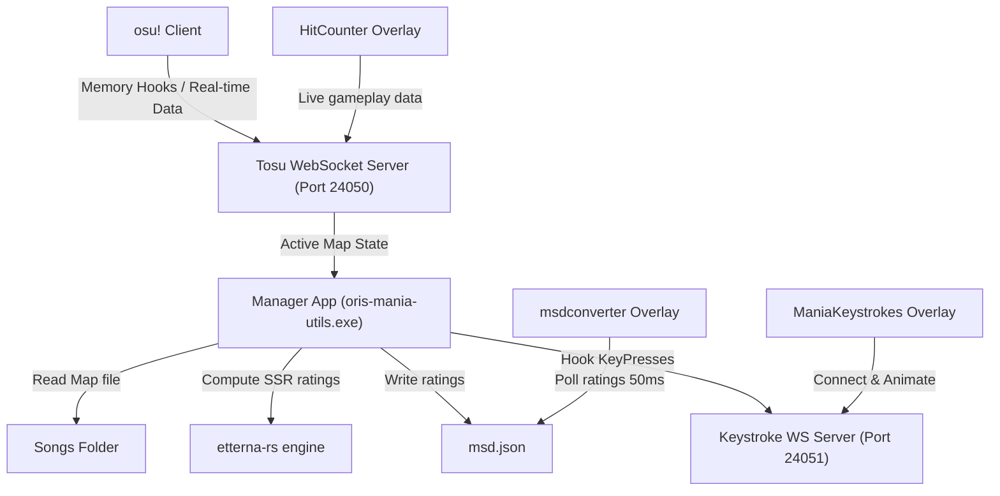
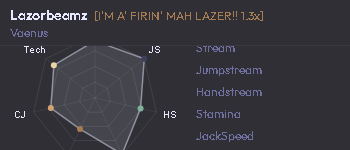
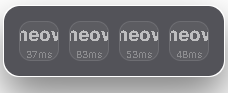
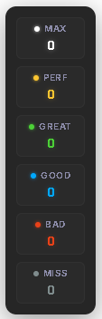

# ori's mania utils
# my discord for suggestions, bug reports, etc: orianawoo

<p align="center">
  <a href="https://tauri.app/"></a>
  <a href="https://www.rust-lang.org/"></a>
  <a href="https://github.com/orianawooo/oris-mania-utils/releases/latest"></a>
  <a href="https://github.com/orianawooo/oris-mania-utils/blob/main/LICENSE"></a>
</p>

A premium, high-performance suite of in-game overlays for **osu!mania 4K**, built on top of the [tosu](https://github.com/tosuapp/tosu) runtime client.

---

## Key Features

* **MSD Rating Calculator**: Dynamically calculates 8-dimensional Etterna difficulty ratings (Stream, Jumpstream, Stamina, Technical, etc.) on map changes using the `etterna-rs` computation library.
* **Keystroke Visualizer**: High-frequency 4K key tracker with configurable outer/inner colors, width offsets, lock trails, fade transitions, and dynamic rainbow RGB support.
* **Judgment Counter**: Real-time play counter tracks MAX, PERF, GREAT, GOOD, BAD, and MISS judgments.
* **Native Fullscreen Injection**: Fully compatible with exclusive fullscreen mode by leveraging Tosu's internal Chromium overlay injector.
* **Centralized Configuration**: Customize styling, sizing, scales, and visible metrics in real-time through a dedicated desktop settings companion app.

---

## Architecture Flow

The manager desktop utility hooks system-wide key presses and acts as an difficulty calculation worker, syncing states with the Chromium-rendered overlays:



---

## Overlay Showcase

| MSD Converter (Radar Chart) | Mania Keystrokes | Hit Counter |
|:---:|:---:|:---:|
|  |  |  |

---

## Setup & Integration

### 1. Run the Manager
Download the latest release zip, extract it anywhere, and run `oris-mania-utils.exe`.

The app will auto-detect:
* your TOSU folder
* your `osu! Songs` folder
* whether the overlays need to be copied into `tosu/static/`

If detection misses something, pick the folder once in the manager and it will remember it.

### 2. Enable TOSU Overlay Mode
Open [http://127.0.0.1:24050/settings](http://127.0.0.1:24050/settings) and make sure **In-Game Overlay** is turned **ON**.

### 3. Add the Overlays
Launch osu!, open Tosu's in-game menu, and add these overlays:
* `msdconverter`
* `ManiaKeystrokes`
* `HitCounter`

### 4. OBS Studio
Add the overlays as **Browser Sources** in OBS:
* **MSD Chart**: `http://localhost:24050/msdconverter/` (350x220)
* **Keystrokes**: `http://localhost:24050/ManiaKeystrokes/` (270x400)
* **Hit Counter**: `http://localhost:24050/HitCounter/` (240x180)

---

## Technical Specifications

| Component | Technology |
|---|---|
| **Manager Core** | [Tauri v2](https://tauri.app) (Rust framework) |
| **Difficulty Parser** | [etterna-rs](https://github.com/kangalioo/etterna-rs) |
| **Overlay Renderers** | Vanilla HTML5 / CSS3 / ES Modules |
| **Animation Loop** | Canvas 2D Context (particle pooling) |
| **Inter-Process Comm** | Tokio WebSocket server (Port 24051) & Tosu API (Port 24050) |

---

## Building From Source

Prerequisites: [Rust (stable)](https://rustup.rs) and [Node.js (v18+)](https://nodejs.org).

```bash
# Clone the repository
git clone https://github.com/orianawooo/oris-mania-utils.git
cd oris-mania-utils

# Install Node dependencies
npm install

# Run the Tauri application in developer mode
npm run tauri dev

# Validate code + config pipeline
npm run check

# Build the stable desktop artifacts (exe + msi)
npm run build:desktop

# Verify overlay/build integrity
npm run smoke

# Produce release-ready zip + copy latest MSI to /dist
npm run release:prep
```

---

## Development Lifecycle

Detailed changes are tracked in the [CHANGELOG.md](./CHANGELOG.md). Contributions, bug reports, and suggestions are welcome via GitHub issues.

For release validation, use the repo checklist in [RELEASE_CHECKLIST.md](./RELEASE_CHECKLIST.md).
